

# **Gottfrids munkar**

Arbetet skrivet av:
Nani Dam,
Alexander Pressfelt,
Evelina Zillman

[Länk till sidan](https://nanidam.github.io/donut.-webshop-MI/)

## **Teknikstack**

**User interface**  
HTML  
CSS  
SASS

**Funktionalitet**  
Javscript

**Versionshantering**  
Git

**Verktyg**  
Visual Studio Code  
Eslint  
Prettier

## **Bilder**

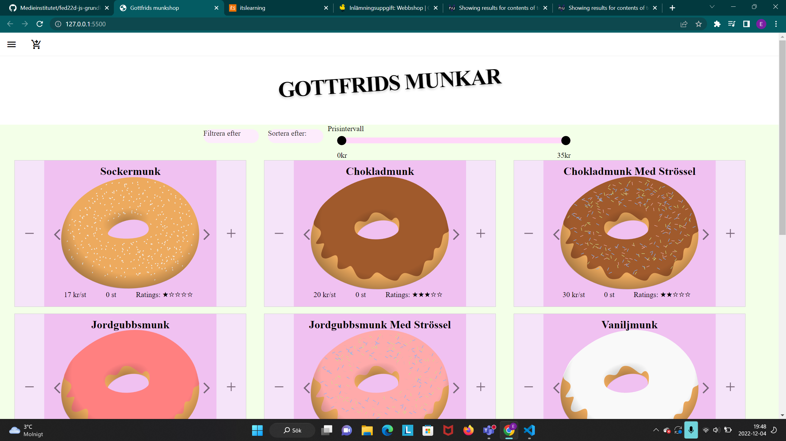

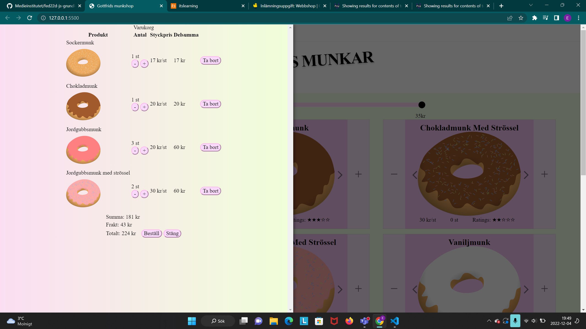

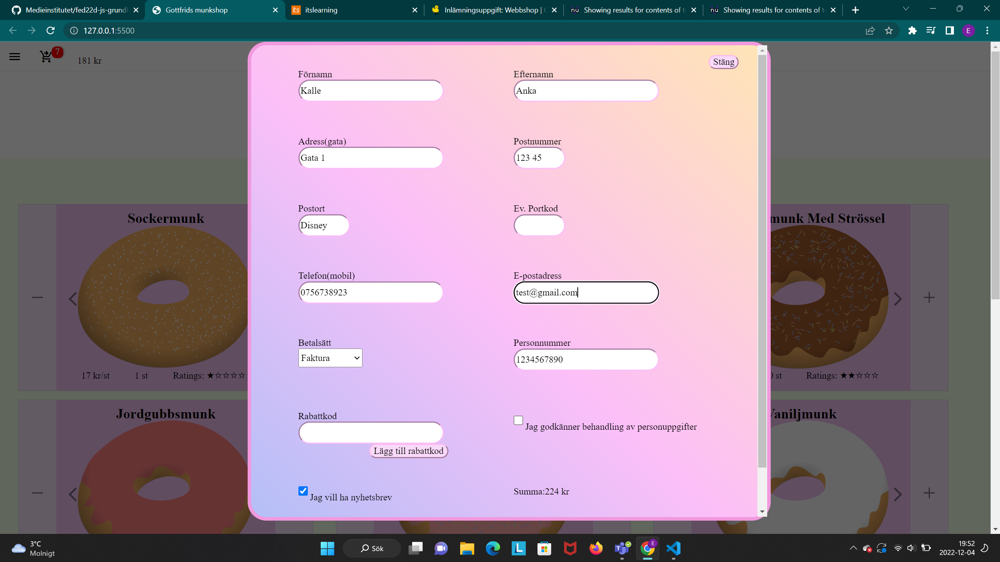

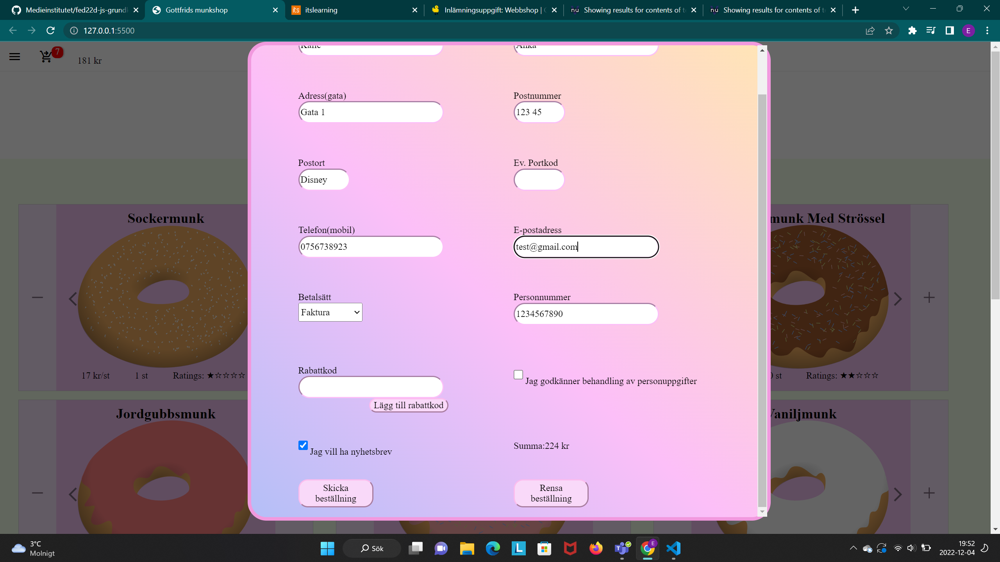

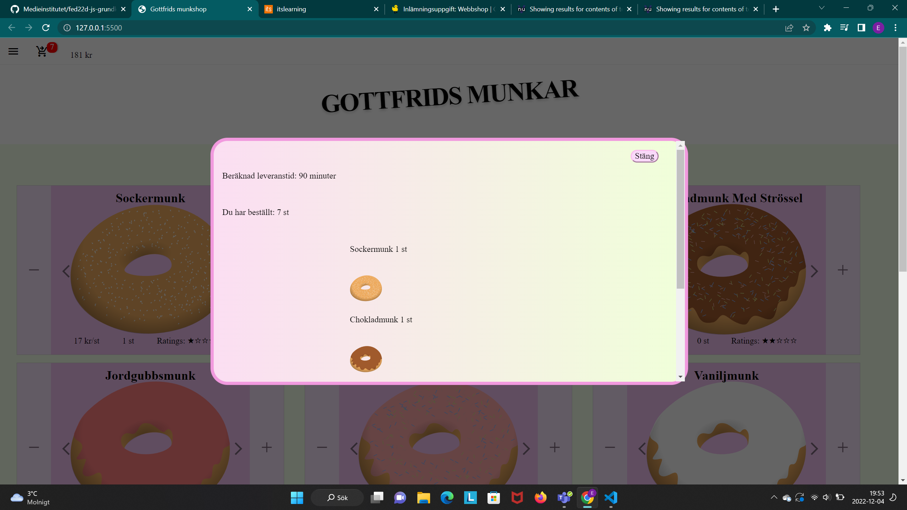

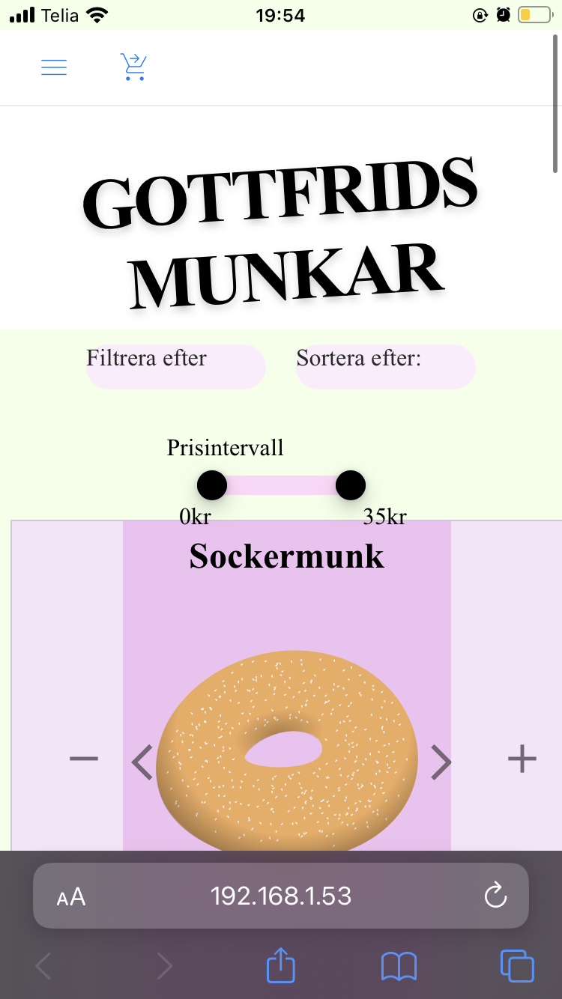

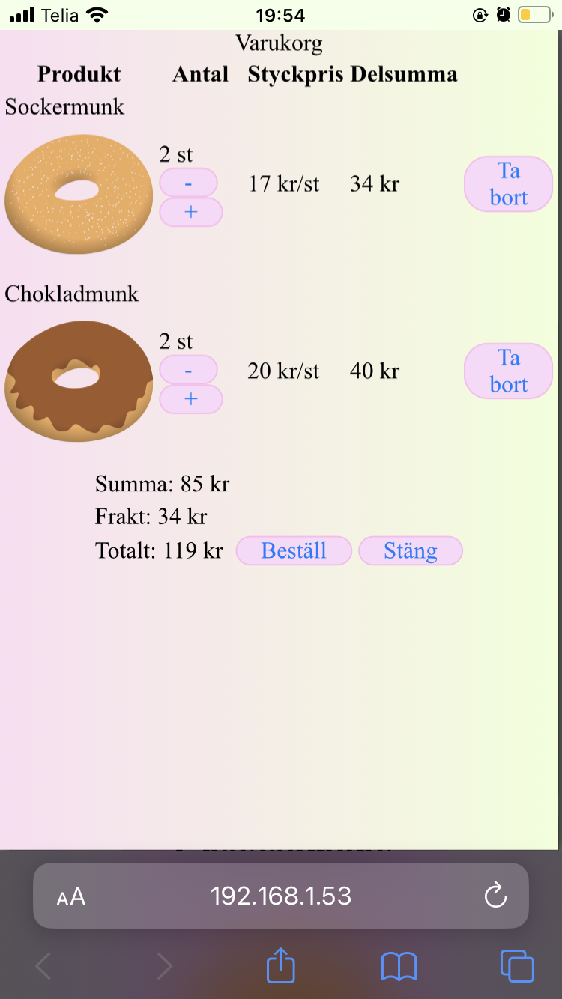

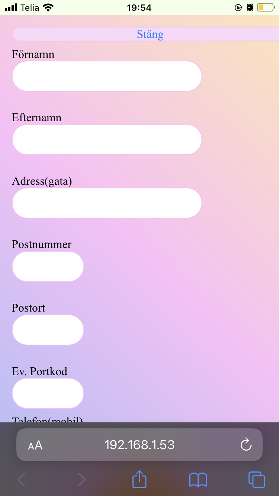

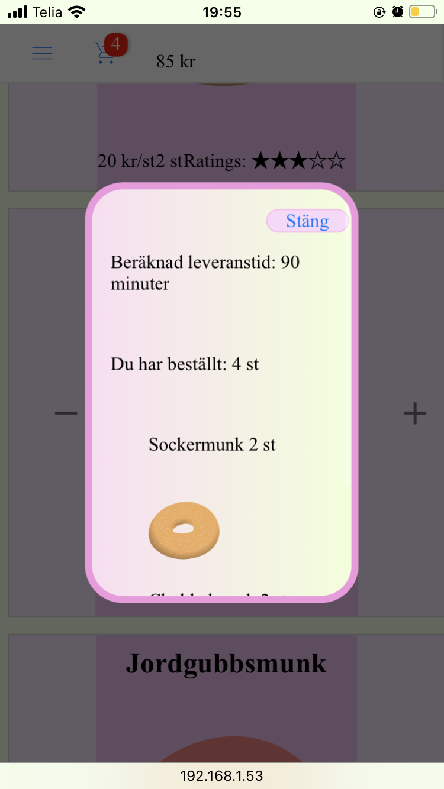

## **Validering / Lighthouse**

### HTML Validering

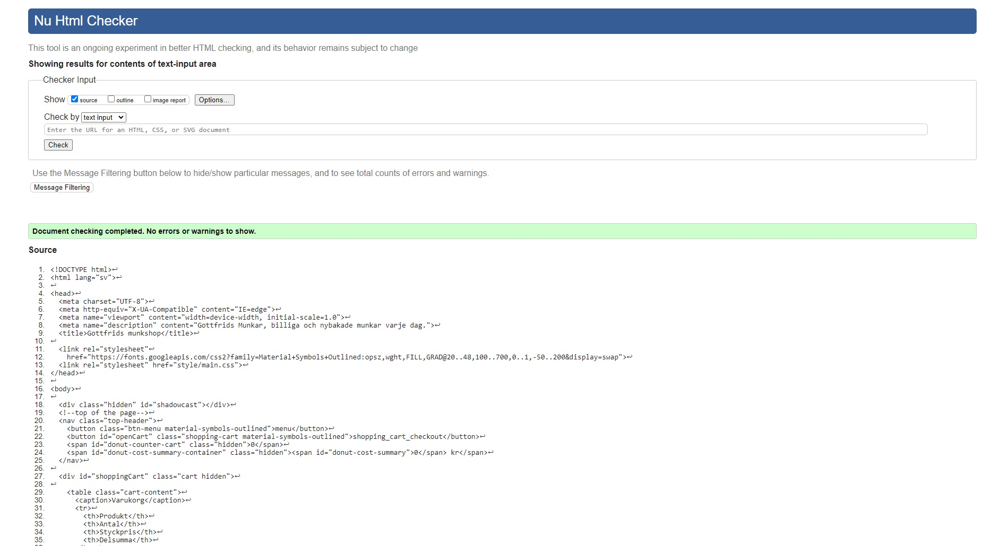

### CSS Validering

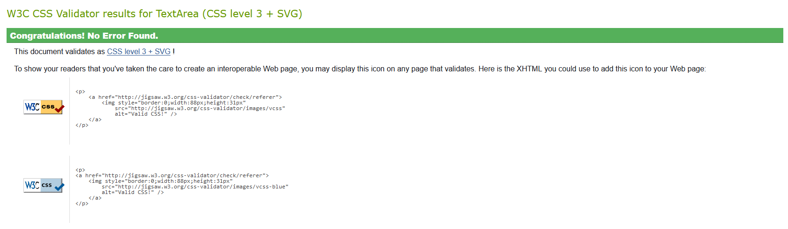

### Lighthouse

Desktop  
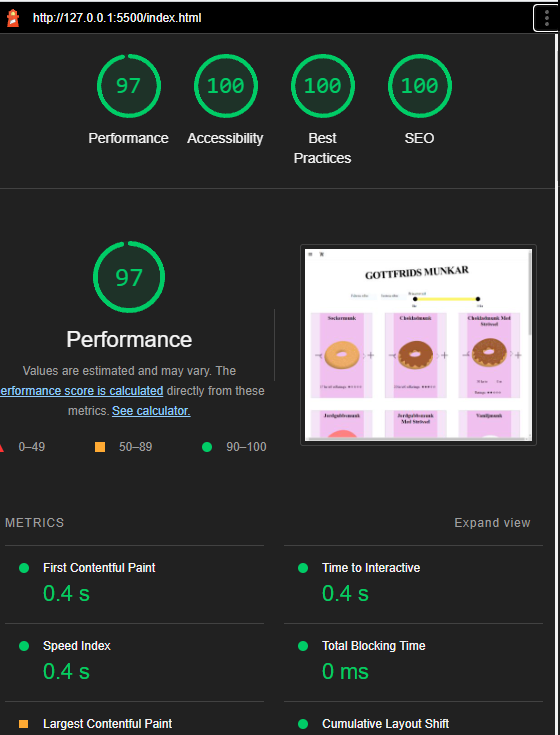  
Mobil  
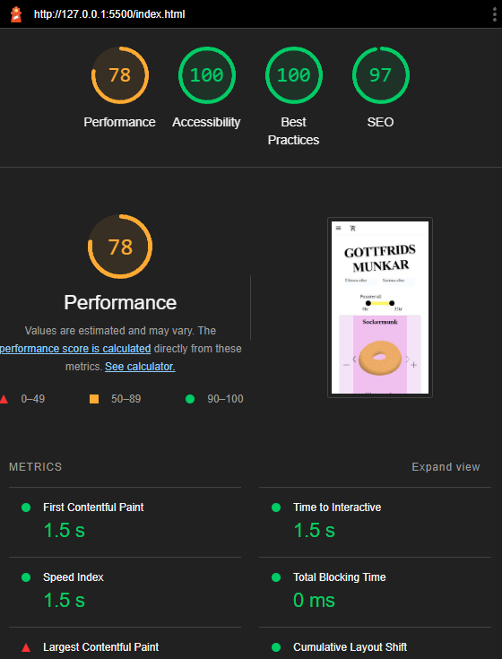  
_Notering: Mycket av mobil performance krav består av bundling av javascript, vilket inte vi har gått igenom._
